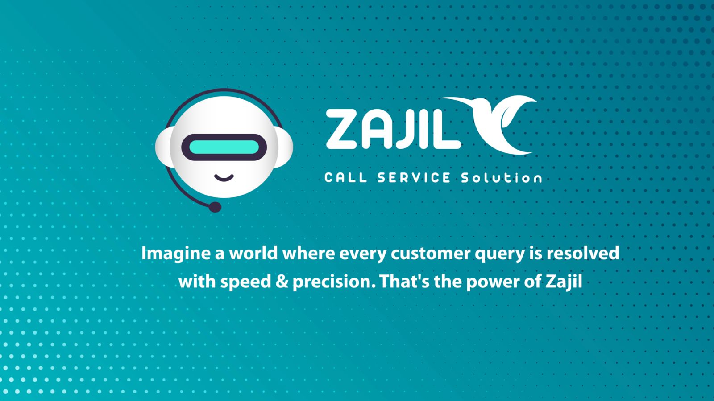

# Zajil: Revolutionizing Call Center Automation 🚀

 <!-- Make sure the image path is correct -->

## Overview 🌐
**Zajil** significantly enhances call center operations by leveraging advanced AI technologies. Developed during the Falcon Hackathon, Zajil aims to transform traditional customer service into a more efficient, scalable, and cost-effective operation using cutting-edge AI.

## Innovation and Technology 🔧
Zajil utilizes Falcon's state-of-the-art AI models and AI71's API Hub to offer:
- **24/7 Automated Customer Service**: Using AI to manage calls and texts at any time.
- **Multilingual Support**: Engaging customers globally in various languages.
- **Intelligent Response Handling**: Employs NLP to understand and respond to customer queries effectively.

## Team 👥
Zajil was created by a diverse team of experts, each bringing unique skills from fields including computer science, information systems, and graphic design.

## Business and Economic Impact 💹
Zajil is designed to:
- **Reduce Operational Costs**: Minimizing the need for extensive human agent networks.
- **Increase Efficiency**: Speeding up response times without compromising quality.
- **Enhance Customer Satisfaction**: Providing consistent and accurate responses.

## Getting Started 🚀
To explore or contribute to Zajil:
1. Clone the repository: `git clone https://github.com/Cat9199/Zajil-Falcon.git`
2. Install dependencies: `pip install -r requirements.txt`
3. Start the application: `flask run`

## Presentation 📄
Explore our detailed presentation on the development and impact of Zajil: [Zajil Presentation](./Zajil.pdf)

## Watch Our Project Overview and Demonstration 🎥
[Watch the Video Here](https://storage.googleapis.com/lablab-video-submissions/clxosrgnm00133b6tlf0k5cgc/raw/submission-video-x-clxosrgnm00133b6tlf0k5cgc-clypzd7wo000u356smz2mmy99_vmu630dux.mp4)

## Falcon Hackathon Participation 🏆
- **Challenge**: Demonstrating practical AI uses in everyday business processes.
- **Innovation**: Showcasing a scalable model for global customer service.

## Connect and Contribute 🤝
We are keen on collaborative growth and warmly welcome contributions:
- Fork this repository.
- Create your feature branch (`git checkout -b feature/AmazingFeature`).
- Commit your changes (`git commit -m 'Add some AmazingFeature'`).
- Push to the branch (`git push origin feature/AmazingFeature`).
- Open a Pull Request.

## Contact 📧
For further details, reach out to us at: `pw91994132.office@gmail.com`

## Acknowledgments 👏
Special thanks to the Falcon Hackathon organizers, AI71, and all mentors who supported the development of Zajil.
